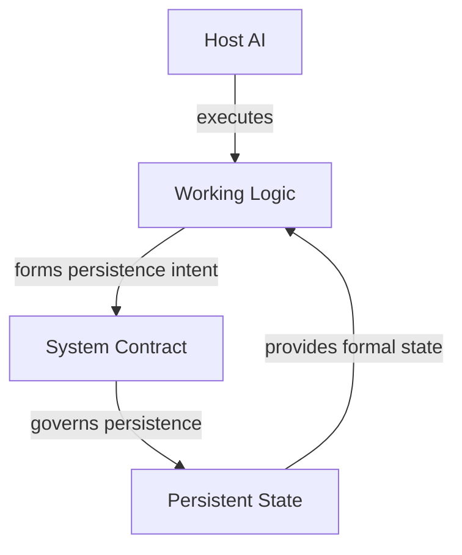

# Long-Running AI Project Design

A set of public design notes for AI projects that need to survive beyond a single chat.

I started treating this as a system-design problem rather than a memory problem when projects began to span many invocations. The failure mode was not simply that a model forgot something. More often, the project lost track of what was *current*, what was merely discussed, what had become stale, and which parts of the system were actually allowed to change.

That led me to a small set of distinctions that now shape how I design long-running AI projects.

The most important one is simple:

**Conversation is useful context, but it is not a reliable source of current state.**

A conversation can contain accepted conclusions, discarded ideas, speculation, old information, and temporary working assumptions. Once a project needs to resume later, those things cannot all carry the same weight.

The same problem appears in other forms. A saved state may be authoritative for what the project last recorded and still be wrong about the outside world today. Historical material can be worth keeping without belonging in every future context. Experience from previous runs can be useful without becoming a permanent rule. And a system can learn something during runtime without gaining permission to rewrite its own production behavior.

This repository is my attempt to make those boundaries explicit.

It is not a product or a universal agent framework. It is a public description of a design method that has emerged from building and revising long-running AI projects.

## The basic model

I currently separate the system into four responsibility domains:



**Host AI** is the execution environment: the model, tools, file access, and interaction surface available in a given run.

**Working Logic** describes how the current version of the project should operate. It covers things such as request interpretation, context construction, evidence handling, research behavior, and decisions about whether new cognition is worth carrying forward.

**System Contract** defines the stable semantics of persistent state: what may exist, where authority resides, how identity is maintained, and what counts as a valid update or recovery action.

**Persistent State** carries the formal state that future invocations actually need.

These are responsibility boundaries, not a prescribed file layout. A project could implement them with Markdown, a database, an object store, platform state, or a hybrid design.

## Why separate them?

Because changes in one part of the system do not automatically imply changes in the others.

A model can be replaced without changing the project state. A project state can change without changing its operating logic. A new piece of evidence can revise the project’s understanding without justifying a new system rule.

Keeping those changes separate makes it easier to answer questions such as:

- Did the host behave differently, or did the project state actually change?
- Is this a stale state problem, or a bad contract?
- Did the project learn something new, or did the rules themselves change?
- Is a recovery failure caused by missing state, or by incompatible host behavior?

That separation has been more useful to me than treating the whole project as “a prompt plus memory.”

## From a run to long-term state

Another recurring problem is deciding what should survive a run.

The naive rule is to persist everything new. In practice, that creates noise quickly. Search results, intermediate analysis, temporary hypotheses, and low-value observations accumulate until persistence itself starts to interfere with reasoning.

I use a two-stage decision instead.

First: **is this cognition worth preserving across runs?**

Second: **if it is worth preserving, does the system contract allow it to be persisted, and where does it belong?**

The interface between those two questions is what I call **Memory Intent**. It is a semantic request such as “update current state,” “record material history,” “update knowledge,” or simply “no write.” It is not a file operation.

This distinction matters because “useful” and “persistable” are different properties.

A run can be useful and still produce no persistent update.

## The minimum system can stay small

I do not assume that every project needs History, Knowledge, Backfill, Compression, Concurrency, or cross-host recovery.

A small long-running project may need only:

- a stable contract for what persistent state means;
- working logic for how the project operates;
- an explicit current state;
- enough recovery discipline to resume safely.

Everything else should earn its place.

That is a recurring theme in these notes: **complexity should enter because a failure made it necessary, not because the architecture looks incomplete without it.**

## How the design evolves

The design process I use is failure-driven.

A recurring sequence looks like this:

```text
Observe a problem
→ isolate one behavior
→ build a synthetic case
→ test it in the target host
→ record the exact failure
→ make the smallest useful rule change
→ retest
→ test interactions
→ keep the failure as a regression case
→ remove rules that no longer earn their cost
```

I use synthetic examples in the public notes so that the mechanism can be discussed without exposing production contracts, prompts, schemas, state, or business logic.

The important part is that the design is tested where it actually runs. A clean rule on paper does not guarantee the same behavior in a real host.

## Where to start

- [Problem Model](docs/01-problem-model.md) — the recurring failures that motivated the design.
- [Architecture](docs/02-architecture.md) — the responsibility boundaries and persistence interface.
- [Principles](docs/03-principles.md) — the smaller set of rules I use to evaluate design decisions.
- [Design Method](docs/04-design-method.md) — how I test, revise, and simplify the system.

## Scope

These notes are deliberately public at the design level, not at the implementation level.

They discuss problems, trade-offs, patterns, validation methods, and abstract architecture. They do not publish production contracts, production prompts, production schemas, real persistent state, business logic, or implementation-specific fixtures.

The notes are also not a claim of universal validation. Some ideas are stable for me; others are still being tested across different project shapes and host behavior.

This repository is `Public v0.1`: a design snapshot, not a finished theory.
