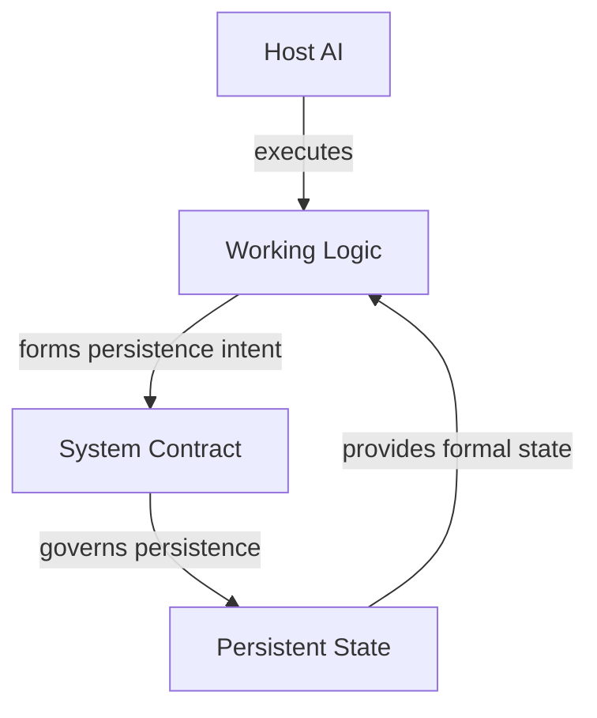

# Architecture

This document is the most formal part of Public v0.1.

The architecture is intentionally small. It defines responsibility boundaries rather than a complete implementation.

## Four responsibility domains



The four domains are:

### Host AI

The host is the environment in which the project actually runs.

Depending on the system, that may include the model, available tools, file access, context handling, and the user interaction surface.

The host matters because behavior is host-dependent. Two hosts may both be able to read the same artifacts and still behave differently under the same instructions.

For that reason, I do not treat host portability as equivalent to behavioral compatibility.

I also do not treat the host as the whole system. If all formal continuity exists only in the current model context, changing the host can implicitly change the project itself.

### Working Logic

Working Logic describes how the current version of the project operates.

It may cover:

- how a request is interpreted;
- what state is loaded;
- how time gaps are handled;
- how evidence is evaluated;
- how tools are used;
- how the system forms its current understanding;
- how it decides whether that understanding has long-term value;
- how output is produced.

Working Logic is allowed to evolve relatively quickly. Search strategy, context construction, and analysis behavior may need revision without changing what persistent state *means*.

### System Contract

The System Contract defines the stable semantics of persistence.

It answers questions such as:

- what kinds of formal state may exist;
- where authority for a given meaning resides;
- how identity remains stable;
- how an update becomes valid;
- what counts as recovery;
- when the system should stop rather than guess.

A contract can say which state is authoritative. It cannot make that state true.

That distinction is important. An authoritative Current may still be stale, incomplete, or wrong about external reality.

### Persistent State

Persistent State carries the formal information that future invocations need in order to continue.

It is not intended to be a complete archive of everything the AI has seen.

Depending on the project, persistent state may contain roles such as:

- Current;
- Identity;
- Evidence;
- History;
- Knowledge;
- Open Questions;
- Recovery State.

Those are examples of semantic roles, not a required module list.

## The role of Current

Current exists for one narrow reason: a future invocation needs somewhere authoritative to ask what the project formally holds now.

This does not mean Current is objectively true. It means it is the formal working state until evidence or recovery work justifies changing it.

That separation becomes especially important after a gap in activity. The system may be able to recover Current immediately while still needing to verify whether Current remains valid in the outside world.

## Cognition and Memory Intent

In these notes, **cognition** means an explicit semantic outcome of the system: a current interpretation, a known boundary, a reusable conclusion, or another result that could matter to future work.

It does not mean hidden chain-of-thought or the transient reasoning trace of a model.

The system still needs a way to decide whether cognition should affect long-term state.

I use **Memory Intent** for that interface.

Examples include:

- update Current;
- add supporting evidence;
- record material history;
- revise reusable knowledge;
- resolve an open question;
- no write.

Memory Intent is deliberately semantic. It should not say “edit line 42 of file X.” The contract decides how an allowed state change is represented physically.

## Two different persistence questions

A common failure in memory systems is to ask only one question:

> Is this worth remembering?

I split that into two.

The first question belongs to Working Logic:

> Does this cognition have enough cross-run value to preserve?

The second belongs to the Contract:

> If it should persist, is there a valid representation for it, and where does it belong?

This distinction prevents two opposite errors.

A project should not save something merely because a schema has a place for it. And it should not invent a new persistent structure merely because the current run produced an interesting idea.

A useful run may legitimately end with no write.

## Change domains

The architecture also separates four kinds of change:

| Change domain | What changed | What did not automatically change |
|---|---|---|
| Host | model, platform, tools, execution behavior | contract, working logic, state |
| Contract | persistent semantics and authority | external reality |
| Working Logic | current operating behavior | persistent meaning |
| State | formal project cognition | contract or operating rules |

This is mostly a diagnostic tool.

When something goes wrong, the first question is not “which rule should I add?” It is “which domain actually failed?”

A host that cannot write reliably is different from a contract with conflicting authority. Both are different from stale state.

## Recovery

Recovery is not the same as starting from nothing.

A bootstrap path handles a genuinely uninitialized project.

Recovery handles an existing project whose state may be incomplete, interrupted, missing, corrupted, or ambiguous.

When existing state cannot be interpreted safely, I prefer an explicit stop over a guessed reconstruction. A complete-looking state built from guesses is often more dangerous than an obvious recovery failure.

This does not mean every local problem should halt the entire project. Fail-closed behavior should match the scope of the broken authority.

## Minimal core

The smallest useful version of this architecture is still small:

- a System Contract;
- Working Logic;
- an explicit Current;
- enough recovery discipline to resume safely.

History, Knowledge, Backfill, Compression, Concurrency, and cross-host recovery are optional capabilities. They should be introduced only when the project has a reason to pay for their complexity.

## Architecture is not file layout

Nothing here requires:

```text
contract.md
instructions.md
state.md
```

A file-based implementation is one option among many.

The architecture is about semantic responsibility. If a database or platform-native state system preserves the same boundaries, it can express the same design.

Likewise, the schema is not a model of reality itself. If reality no longer fits the current structure, the structure should change before the project distorts reality to keep the schema tidy.

That principle has saved me from treating implementation neatness as epistemic correctness.
