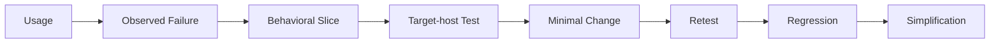

# Design Method

The architecture in this repository was not designed all at once.

Most of it came from a repeating cycle: a project behaved badly in a specific way, I isolated that behavior, tested a smaller case, changed as little as possible, and then checked whether the fix created a new problem somewhere else.

This document describes that process.

## Start with an observable failure

“AI forgets things” is not a useful engineering statement.

“In a new invocation, an unaccepted candidate from the previous conversation is treated as formal current state” is much better.

The second statement gives me something I can reproduce.

A useful failure description usually contains four pieces:

- what I expected;
- what actually happened;
- the boundary in which it happened;
- why it matters to later behavior.

The goal is to make the failure specific enough that another run can prove whether it still exists.

## Reduce the failure to one behavioral slice

Large instruction sets are hard to debug because too many rules interact at once.

I therefore isolate a **behavioral slice**: the smallest behavior that can fail independently.

For the Current example, the test might be:

```text
Given:
Formal Current = A

When:
B is discussed as a possibility
but never formally adopted

Then:
A later invocation should still resolve Current as A
unless new evidence justifies a formal change
```

This is deliberately narrow. It does not test the entire project.

That is the point.

## Use synthetic cases before real complexity

The first test case should remove as much business detail as possible.

For example:

```text
Session 1:
Current = A

Session 2:
Discuss B, but do not adopt it

Session 3:
Ask what is current
```

Synthetic cases make attribution easier. If the test fails, I know the problem is likely in the mechanism being tested rather than in domain-specific ambiguity.

They are not evidence of production readiness. They are a way to find out whether the mechanism behaves coherently at all.

## Test in the target host

A design can be internally consistent and still fail in the environment where it runs.

Different hosts may:

- follow instructions differently;
- handle long context differently;
- expose different file semantics;
- behave differently around tools;
- recover state differently;
- fail in different ways.

So I treat target-host testing as part of the design, not a final deployment check.

The same artifacts being readable in two hosts does not mean the two hosts are behaviorally compatible.

## Record the exact failure before changing the rules

When a test fails, I try not to respond with “the model is unstable.”

That description is too broad to improve the system.

A better note is:

> The host loaded Current=A correctly, but later summarized the recent conversation and replaced A with B.

That observation points toward a specific boundary failure.

Only after I can describe the failure clearly do I change the design.

## Make the smallest rule change that addresses the failure

This is the part I find easiest to violate.

A single failure can make a large new mechanism feel justified. Usually it is not.

If recent conversation can override Current, the first fix should be a narrow authority rule around Current. It should not automatically create a new state layer, a new object type, a new ledger, and a new recovery protocol.

Every new hard rule creates another interaction surface.

The smallest useful change is easier to understand, test, remove, and generalize later if the evidence supports it.

## Retest the original slice first

Before testing anything new, I rerun the case that originally failed.

If the failure still exists, the current change is not finished.

This sounds obvious, but it prevents a common pattern in AI-system design: adding more instructions around an unresolved failure until nobody can tell which part of the system is doing the work.

## Then test interactions

A local fix can create a global problem.

For example, a strong Current authority rule can prevent conversation from casually changing state. Good.

The same rule can become too strong and prevent new evidence from legitimately revising Current. Bad.

So the combined behavior has to satisfy both conditions.

This is where many “good” rules break. They work in isolation but fail when another valid rule pushes in the opposite direction.

## Turn real failures into regression cases

Once a failure has been observed and fixed, I keep it.

Future changes to the host, contract, working logic, or context strategy should be checked against the same case.

The regression suite therefore grows from actual failures rather than from a desire to enumerate every theoretical possibility.

That keeps the tests connected to evidence of necessity.

## Remove rules as well as adding them

Long-running instruction sets tend to accumulate.

The usual loop is:

```text
failure
→ add rule
→ another failure
→ add another rule
→ never remove anything
```

Eventually the system becomes hard to reason about even if every individual rule once had a reason to exist.

I use ablation for this. Remove or weaken a rule, rerun the relevant tests, and see whether behavior materially degrades.

If it does not, the rule may be redundant, obsolete, or already covered by a more general principle.

Simplification is part of validation.

## Use adversarial cases when a boundary matters

Some failures only appear when the input strongly tempts the system to cross a boundary.

If Current authority matters, repeat an incorrect candidate several times and see whether recency wins.

If source independence matters, present several reports that derive from the same origin and see whether quantity is mistaken for independence.

Adversarial tests are useful because they test the boundary itself rather than the easy path.

## Keep validation claims scoped

I do not treat “designed,” “tested,” and “production-observed” as interchangeable.

A mechanism may be:

- defined on paper;
- tested with a synthetic case;
- tested in a target host;
- tested in interaction with related mechanisms;
- protected by regression cases;
- observed in real long-running use.

Those are different claims.

They also need scope. A mechanism tested in one host and one version has not thereby been validated everywhere.

## Diagnose the domain before fixing the failure

A failure does not automatically mean the contract is wrong.

The problem may be:

- the host cannot perform a required operation reliably;
- the contract gives conflicting authority;
- the working logic failed to load or use valid state;
- the state itself is stale.

Those require different fixes.

This is one reason the architecture separates Host, Contract, Working Logic, and State in the first place: the separation improves diagnosis.

## Compress only after behavior stabilizes

Design notes can be verbose. Production rules should not be.

But compressing too early is risky because short wording can hide distinctions that have not yet been tested.

My preferred order is:

```text
understand
→ test
→ stabilize
→ compress
```

Compression is the last step, not the first.

## What I try to avoid

I try to avoid a few recurring design habits:

**Giant Prompt First.** If everything is encoded in one large instruction set before behavior is isolated, failure attribution becomes difficult.

**Importing mechanisms by analogy.** A mechanism can be well established elsewhere and still be unnecessary here. I want an observed requirement before paying for its complexity.

**Universal Framework First.** I do not want to decide that every long-running AI project needs the same object model, history system, or recovery machinery.

**Save Everything.** More stored information usually creates more selection and authority problems.

**Runtime self-promotion of rules.** Learning can propose rule changes. It should not silently approve them.

## The loop

The process can be summarized without turning it into a rigid workflow:



The point is not that every design change must pass through an identical checklist.

The point is that important rules should have a traceable reason to exist.

If I cannot explain which problem a piece of complexity solves, which failure exposed the problem, and what evidence shows the mechanism helps, I treat that complexity as suspect.
