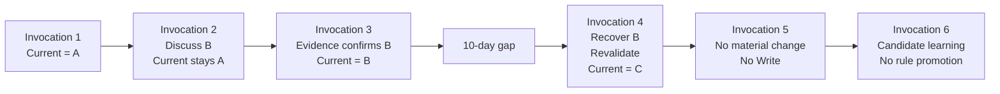

# Worked Example: Maintaining State Across AI Invocations

The previous notes describe a set of boundaries in fairly abstract terms.

This example shows what they look like when a small AI project actually moves through several invocations.

The example is entirely synthetic. It is meant to illustrate the mechanics without exposing any production contract, prompt, schema, state, business logic, or real test fixture.

## The project

Assume an AI project is tracking the status of a fictional initiative called **Northstar**.

The project is simple enough that we only need one formal state:

```text
Current:
Northstar is in State A.
```

At this point, the important thing is not what “State A” means.

What matters is that the project has an explicit answer to:

> What do we formally hold as current right now?

That answer exists independently of whatever happens to be discussed in the next conversation.

---

## Invocation 1: establish Current

The first invocation reviews the available information and ends with:

```text
Current = A
```

The project persists that state.

Nothing unusual has happened yet. Conversation and formal state happen to agree.

The distinction only becomes visible later.

---

## Invocation 2: discuss an alternative without adopting it

A later conversation explores whether Northstar may already have moved into **State B**.

The discussion is extensive.

Several arguments in favor of B are considered. Some evidence is suggestive, but the project does not judge it strong enough to change the formal state.

The conversation may now contain much more text about B than about A.

But the run ends with:

```text
Current = A
```

No formal transition has occurred.

This is exactly the kind of situation where conversation recency becomes dangerous.

A fresh invocation that only looks at recent discussion might conclude:

> B is what the project currently believes.

That would be wrong.

The project discussed B. It did not adopt B.

For this run, the correct persistence result is simply:

```text
No material state change.
```

Depending on the project, the exploratory discussion may have no cross-run value at all.

A useful run does not have to produce a persistent write.

---

## Invocation 3: new evidence actually changes the state

A later run receives stronger evidence.

This time, the project concludes that State B is no longer just a possibility. It is now the best formal representation of the initiative.

The important change is:

```text
Current:
A → B
```

The run may form a semantic persistence request such as:

```text
Memory Intent:
Update Current to B
```

If this project has a meaningful History layer, it may also record the transition:

```text
Material transition:
A → B
```

If History is not useful for this project, the system does not need to create it merely because a transition occurred.

The key point is that the change happened because evidence justified a state transition.

It did not happen because B had been discussed frequently.

---

## What changed here?

Only the formal state needed to change.

The project did **not** automatically need:

- a new System Contract;
- a new Working Logic;
- a new host;
- a new object model.

The event was a state update, not a redesign of the system.

This distinction becomes useful when diagnosing changes later.

If every new conclusion also modifies the rules that produced it, the project becomes difficult to reason about very quickly.

---

## Ten days pass

Now assume the project is not invoked for ten days.

When it resumes, the last formal state is still:

```text
Last known formal state = B
```

That is useful.

It tells the project where it left off.

But ten days have passed outside the system.

Nothing about successful recovery proves that Northstar is still in B.

This is where recovery and reality revalidation separate.

---

## Invocation 4: recover first, then revalidate

The project resumes.

The first step is to recover the formal state:

```text
Recovered Current = B
```

At this moment, B should be understood as:

> the last valid formal state known to the project.

It should not yet be treated as proof of present external reality.

The project then checks what has happened during the gap.

Suppose new evidence shows that Northstar has since moved into **State C**.

The sequence is therefore:

```text
Recover B
→ recognize a ten-day gap
→ check current evidence
→ conclude C
→ update Current to C
```

The recovered state was not “wrong” as a recovery artifact.

It was simply stale as a description of reality now.

This is an important distinction because it prevents the project from treating persistence as freshness.

---

## Do we need to reconstruct B → C in detail?

Not necessarily.

Suppose the current task only asks:

> What is Northstar’s status now?

If current evidence is strong enough to establish C, the project may not need to reconstruct every intermediate event that occurred during the ten-day gap.

It can establish:

```text
Current = C
```

without claiming that it knows the entire path from B to C.

If the path later becomes important—for example, because the user asks why the transition occurred—then reconstruction can happen as a separate task.

This keeps recovery proportional to the task.

The project restores enough continuity to continue safely without turning every inactive period into a complete historical backfill.

---

## Invocation 5: a useful run with no persistent change

A later invocation performs another review.

The system checks the relevant evidence and concludes:

```text
Current still = C
```

No material transition has occurred.

The run may still be useful. It may answer a user question, explain why C remains the best current state, or clarify a boundary in the available evidence.

But none of that automatically creates long-term memory value.

The persistence outcome can be:

```text
Memory Intent:
No Write
```

That is not a failed run.

It is a run in which the project learned nothing that requires a formal state change.

---

## A sixth invocation: learning something without changing the rules

Now suppose the project notices a recurring pattern while reviewing several synthetic cases:

> When condition X appears, State C often becomes unstable.

That observation may be useful.

But it does not immediately become a production rule such as:

```text
If X, always assume C is unstable.
```

The project can treat it as a candidate piece of reusable knowledge or a candidate design issue.

If the observation is important enough, it can be tested.

Only after repeated evidence and an explicit governance decision should it affect stable production behavior.

This keeps runtime learning separate from rule promotion.

---

## The full sequence

The entire example can be summarized like this:



And the responsibility changes look like this:

| Event | Current | Working Logic | System Contract |
|---|---|---|---|
| Establish A | A | unchanged | unchanged |
| Discuss B without adopting it | A | unchanged | unchanged |
| Evidence justifies B | B | unchanged | unchanged |
| Ten-day inactivity gap | B is recovered | unchanged | unchanged |
| Revalidation finds C | C | unchanged | unchanged |
| Useful no-change review | C | unchanged | unchanged |
| Candidate learning appears | C | unchanged unless separately governed | unchanged unless separately governed |

The table is intentionally boring.

That is the point.

Most runs should not require the architecture itself to change.

---

## What this example is meant to show

Several ideas from the earlier documents appear here without needing separate machinery for each one.

### Conversation can contain more recent information than Current without becoming authoritative

Invocation 2 contains extensive discussion of B.

Current remains A.

### A saved state can be valid as a recovered state and stale as a description of reality

Invocation 4 recovers B correctly.

New evidence then establishes C.

### History is optional

The A → B transition can be recorded if the path has future value.

The architecture does not require a History layer simply for conceptual completeness.

### Persistence is selective

Invocation 5 is useful and still ends with No Write.

### Runtime learning does not automatically change production rules

Invocation 6 surfaces a candidate pattern.

It does not promote that pattern into stable behavior by itself.

### Most changes are local

A change in Current does not automatically imply a change in Working Logic or the System Contract.

That separation keeps the system easier to diagnose and revise.

---

## Why use a synthetic example?

A real production case would contain much more detail:

- domain-specific objects;
- real evidence;
- actual schemas;
- host constraints;
- recovery artifacts;
- production rules;
- implementation-specific failure modes.

Those details are important inside the real system, but they would obscure the mechanism here and expose implementation information that is outside the scope of this repository.

The synthetic example is deliberately smaller.

Its job is not to prove that this architecture is production-ready.

Its job is to make one thing concrete:

> A long-running AI project needs a way to distinguish what was discussed, what was formally held, what is still true, what deserves persistence, and what is allowed to change the rules.

That distinction is the foundation for the rest of the design.
